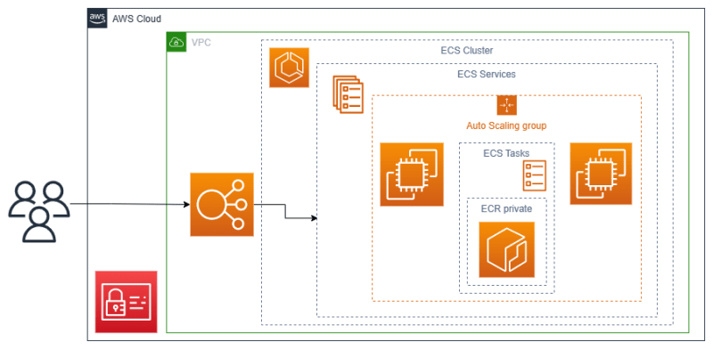

# README

*** Repository Overview ***
This repository contains the source code and infrastructure configurations for an application written in Ruby on Rails (ROR). The repository is structured to facilitate continuous integration and continuous deployment (CI/CD) using GitHub Actions.
The application is deployed to Amazon Web Services (AWS) Elastic Container Service (ECS) and relies on MySQL 8.0 RDS for its database.
The CI/CD pipeline is responsible for building the application, creating a container image, storing it in Amazon Elastic Container Registry (ECR), and deploying it to ECS.
Load balancing for the application is handled by an Application Load Balancer (ALB).

* Ruby on Rails Application:

The ROR example blog application source code is located in the root directory.
Ruby version: `3.2.2`

* GitHub Actions Workflow:

The CI/CD pipeline configuration is stored in the `.github/workflows` directory.

* Terraform Infrastructure:
Terraform version used: `v1.5.7`
Infrastructure configurations for deploying the application are divided into two parts:
 1. Initial manual configurations: `terraform/manual` 
 2. Automated configurations: `terraform/auto`

* Database:
MySQL v8.0 RDS

* Monitoring
ECS has enabled CloudWatch monitoring

* Scalability

The application is deployed to AWS Elastic Container Service (ECS), and load balancing is achieved using an Application Load Balancer (ALB).
Application automatically scales according to the CPU/Mem consumption

* GitHub Actions Secrets:

Credentials and other sensitive information used in the GitHub Actions workflows are securely stored as secrets within GitHub.

*** CI/CD Workflow ***
CI/CD process performs the following steps:

1. Build:
The application code is built and dependencies are installed.

2. Test:
Unit tests, integration tests, or any other specified tests are executed.

3. Docker Image Creation:
A Docker container image is created, and the application code is bundled into it.

4. Amazon ECR:
The container image is pushed to Amazon Elastic Container Registry (ECR).

5. ECS Deployment:
The new container image is deployed to AWS ECS, ensuring the application is up-to-date.

*** Terraform Infrastructure ***
The Terraform configurations are divided into two parts for ease of management:

1. Manual Part (`terraform/manual`): Contains configurations that require manual intervention or setup. This include VPC, RDS DB and ECS cluster.

2. Automated Part (`terraform/auto`): Includes automated configurations that are used for provisioning. This include ECS, security groups, container definition and ALB.

CI/CD SCHEME:
Commit/PR -> Trigger build -> Build -> Test -> Deliver build to ECR -> Terraform updates ECS

Architecture diagram:
